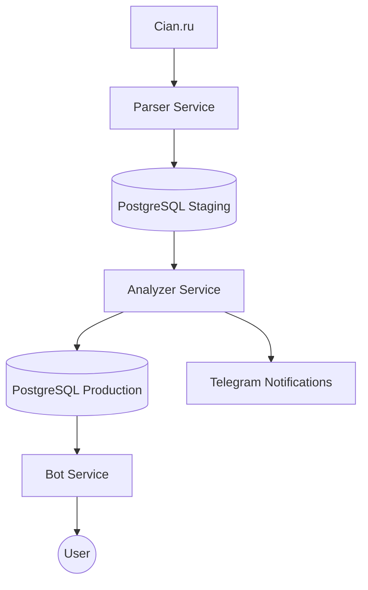

# 🏠 BestPriceCianTelegramBot

[](https://www.python.org/downloads/)
[](https://www.postgresql.org/)
[](https://alembic.sqlalchemy.org/)
[](https://docs.pytest.org/)

Модульная микросервисная система для автоматизированного поиска, анализа и мониторинга объявлений о недвижимости "ниже рынка" на Cian.ru.

---

## 🌟 Основные возможности

- **🤖 Полная автоматизация**: Непрерывный сбор данных 24/7 без участия человека.
- **🔍 Глубокий парсинг**:
  - Извлечение данных об этажах, количестве просмотров и точном адресе.
  - Определение "свежести" объявления по ежедневным просмотрам.
- **📊 Интеллектуальный анализатор**:
  - Сравнение цен с рыночными бенчмарками в реальном времени.
  - Система сегментации цен (Эконом, Комфорт, Бизнес).
  - Автоматическое отсеивание аукционов и сомнительных предложений.
- **📱 Продвинутый Телеграм-бот**:
  - Удобный видео-плеер для просмотра фотографий и описаний.
  - Фильтрация по популярности (>100 или >200 просмотров в сутки).
  - Личный кабинет с "лайками" и "дизлайками".
- **📅 История цен**: Сохранение всех изменений стоимости для каждого объекта.

---

## 🏗 Архитектура системы

Проект построен на микросервисной архитектуре для обеспечения масштабируемости и отказоустойчивости.



### Сервисы:
1.  **Parser Service**: Регулярно сканирует поисковые выдачи Циан. Использует BS4 и LXML. Сохраняет "сырые" данные в промежуточную базу.
2.  **Analyzer Service**: Самый "умный" компонент. Обрабатывает новые записи, применяет фильтры, считает статистику и решает, достойна ли квартира внимания пользователя.
3.  **Bot Service**: Aiogram-бот для взаимодействия. Предоставляет доступ к Production-базе, позволяет управлять фильтрами и просматривать отобранные объекты.

---

## 🚀 Быстрый старт (Docker)

Рекомендуемый способ запуска для стабильной работы всех компонентов.

1.  **Настройка окружения**:
    ```bash
    cp .env.example .env
    ```
    Обязательно заполните `BOT_TOKEN` и добавьте ссылки на поиск в `CIAN_URLS`.

2.  **Запуск через Docker Compose**:
    ```bash
    docker compose up --build -d
    ```
    *Миграции базы данных и инициализация таблиц применятся автоматически.*

---

## 🛠 Ручная установка и настройка

### Требования
- Python 3.11+
- PostgreSQL

1.  **Установка зависимостей**:
    ```bash
    python -m venv .venv
    source .venv/bin/activate
    pip install -r requirements.txt
    ```

2.  **База данных (Alembic)**:
    Проект использует Alembic для управления схемой.
    ```bash
    # Применить все миграции
    alembic upgrade head
    
    # Сброс и инициализация через скрипт (опционально)
    python core/database/init_db.py
    ```

---

## 🧪 Тестирование

Проект покрыт юнит и интеграционными тестами.

- **Unit-тесты**: Проверка логики фильтрации, парсинга HTML и сервисов БД.
- **Integration-тесты**: Проверка взаимодействия бота с пользователем и эмуляция callback-запросов.

```bash
# Запуск тестов
pytest tests/

# С генерацией отчета о покрытии
pytest --cov=core --cov=services
```

---

## 📂 Структура проекта

```text
├── core/               # Ядро: модели, конфиг, общие сервисы
├── services/
│   ├── bot/            # Телеграм-интерфейс (aiogram)
│   ├── parser/         # Сбор данных (requests/bs4)
│   └── analyzer/       # Логика обработки и фильтрации
├── migrations/         # Миграции базы данных (Alembic)
├── tests/              # Тестовое покрытие (PyTest)
├── scripts/            # Вспомогательные утилиты (экспорт, метро)
└── docker-compose.yml  # Оркестрация контейнеров
```

## 📝 Лицензия

Распространяется под лицензией MIT
